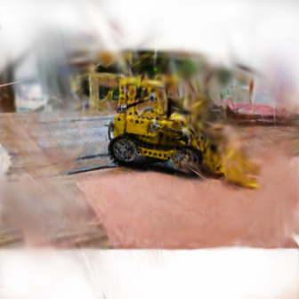
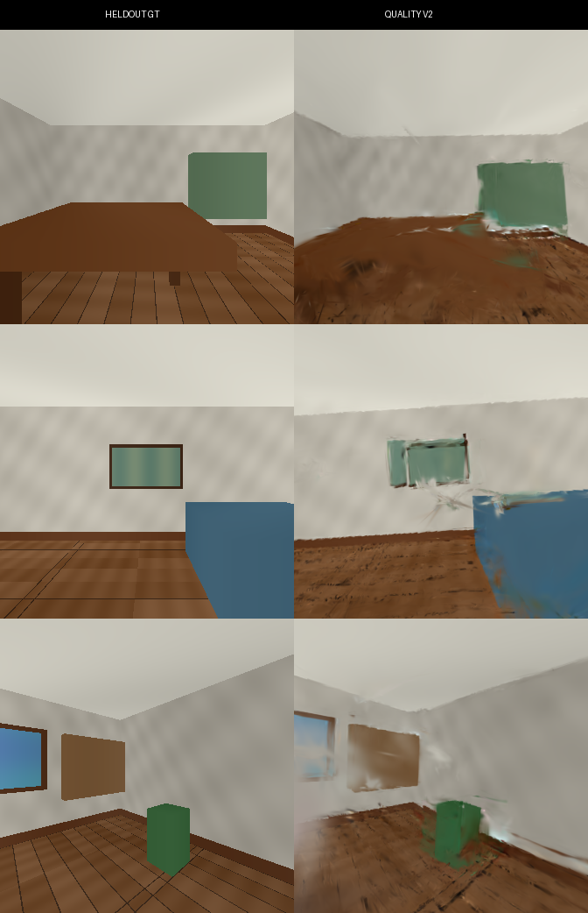
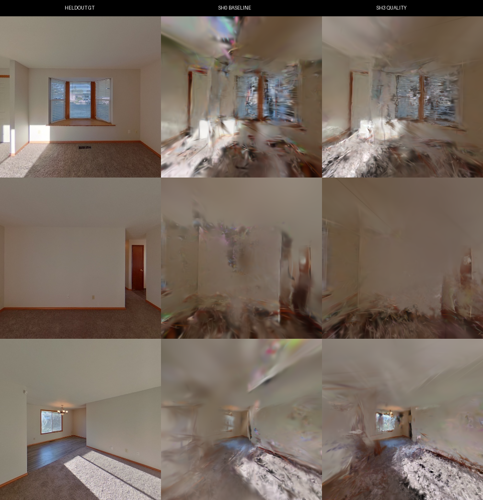
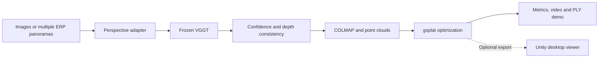
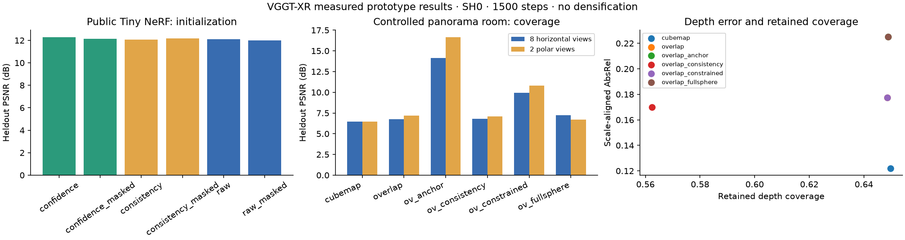

# 🌐 VGGT-XR

[](https://github.com/BoPythonAI/VGGT-XR/actions/workflows/geometry.yml)
[](https://www.python.org/)
[](https://pytorch.org/)
[](https://developer.nvidia.com/cuda-toolkit)
[](https://docs.gsplat.studio/)
[](reports/PANORAMA_EXTENSION_REPORT.zh-CN.md)
[](https://repo-sam.inria.fr/fungraph/3d-gaussian-splatting/)
[](https://github.com/BoPythonAI/VGGT-XR/releases)
[](LICENSE)
[](https://github.com/BoPythonAI/VGGT-XR/stargazers)

> 2026-09-15 quality update: true SH3, bounded adaptive density, high-resolution supervision, training-only BA, panorama-rig pose refinement, and frozen three-seed evaluation are available in the [quality report](reports/QUALITY_REPORT.zh-CN.md) and [deep research review](docs/QUALITY_DEEP_RESEARCH.zh-CN.md).

> 2026-09-15 panorama extension: the colored analytical room now has a visually natural replacement with exact geometry, plus a real-capture ZInD heldout-position test. Protocols, metrics, limitations, and reproduction commands are in the [panorama extension report](reports/PANORAMA_EXTENSION_REPORT.zh-CN.md); machine-readable results are in [panorama_extension.json](reports/panorama_extension.json).

An inference-only pipeline from perspective images or multiple 360° panoramas to confidence-filtered geometry, COLMAP, gsplat Gaussians, quantitative evaluation, and reproducible render artifacts. A Unity keyboard/mouse viewer is retained as an optional export target.



[Real kitchen gsplat flythrough](assets/gsplat_kitchen.mp4) · [Synthetic 360° gsplat flythrough](assets/gsplat_panorama.mp4) · [Measured results](reports/REPORT.md) · [Chinese execution plan](docs/EXPERIMENT_PLAN.zh-CN.md)

The colored grids and radial bands in the synthetic 360° demo are intentional world-coordinate textures in the analytical ground truth, not simulated lighting. See the [ground-truth verification and artifact-control ablation](reports/ARTIFACT_CONTROL_REPORT.zh-CN.md).





The replacement natural analytical benchmark uses warm, low-contrast materials and exact depth/poses. The real ZInD test trains on panoramas 2/4/6 and evaluates only at heldout panorama 5. The quality path improves all three real heldout metrics over the equal-step SH0 baseline, although sparse-input novel-view blur remains visible.

These are actual CUDA gsplat renders and constitute the final visual validation for the current project scope. Unity execution is intentionally excluded from the acceptance criteria.



## 🎯 Scope

VGGT baseline, 360° projection, confidence filtering, Gaussian Splatting, quantitative evaluation, and a reproducible GitHub demo. The project does not retrain VGGT. On 2026-09-15 the user removed Unity runtime validation from the stop line; the existing Unity export code remains optional. Headset OpenXR integration and semantics are outside the stop line.

Multiple translated panorama centers are required for meaningful multiview geometry. Faces cut from one ERP share a camera center and provide no translational parallax. VGGT confidence is an uncalibrated reliability score, not a probability.

## 🖥️ Server setup

The execution environment uses an RTX 5090, existing PyTorch 2.12.1+cu130 and CUDA 13.0. gsplat 1.5.3 is compiled for `sm_120`; its CUDA forward and backward must pass `scripts/cuda_smoke.py`. All large files are placed on the AutoDL data disk.

```bash
mkdir -p /root/autodl-tmp/vggt-xr
# Copy this repository there, then:
cd /root/autodl-tmp/vggt-xr
python -m venv --system-site-packages env
source scripts/environment.sh
pip install -r requirements.txt
git clone https://github.com/facebookresearch/vggt third_party/vggt
python scripts/cuda_smoke.py
python scripts/download_weights.py
python scripts/prepare_data.py
```

The ranged downloader uses a mirror of the official `facebook/VGGT-1B` checkpoint and verifies the LFS SHA256 before use. The standard Hugging Face downloader remains supported. Refer to [VGGT's official code, checkpoint and license](https://github.com/facebookresearch/vggt) before using or distributing upstream materials. VGGT officially provides COLMAP export and gsplat integration; this project's projection, filtering, fixed-budget optimizer and desktop controls are separate code.

## 🚀 One command

```bash
source scripts/environment.sh
python run.py --input data/analytic_room --panorama \
  --projection overlap --filter confidence --output outputs/my_room

# Perspective images under INPUT/images/:
python run.py --input data/tiny_nerf --filter confidence --output outputs/my_lego
```

Outputs contain `images/`, `vggt/`, `geometry/`, `sparse/0/`, `gaussian/`, and JSON summaries. `gaussian/scene.ply` uses standard 3DGS fields; the baseline keeps higher coefficients at zero, while `scripts/improve_quality.py` exports trained SH coefficients. Point cloud and confidence PLYs are separate diagnostic layers.

For complete polar coverage and the tested anchor configuration:

```bash
python run.py --input data/analytic_room --panorama --projection overlap \
  --include-poles --max-views 32 --constrain-poses --pose-fusion anchor \
  --known-intrinsics --filter confidence --output outputs/full_room
```

`--filter raw|confidence|consistency`, `--confidence-quantile`, `--projection direct|cubemap|overlap`, `--constrain-poses`, `--max-views`, `--max-points`, `--steps`, and `--geometry-only` control the experiment. Default budget: 24 views, 336×336, 30k Gaussians, 1500 optimization steps. Outputs cache predictions and completed runs; use a new output directory when changing input or settings.

## 📊 Experiments



14 final configurations completed and their COLMAP, prediction fingerprints, finite Gaussian parameters and point counts were verified. The 30-view anchor/known-intrinsics variant reached 14.65 dB heldout development PSNR versus 7.14 dB without the constraint. Depth errors remain significant; Tiny NeRF confidence filtering gives only a small PSNR change. These are prototype measurements.

```bash
python -m pytest -q tests
python scripts/run_experiments.py --steps 1500
python evaluation/report.py
```

The public Tiny NeRF dataset is originally 100×100; resizing does not create detail. The panorama benchmark is an explicitly labelled analytical synthetic room, not Replica or real capture. Heldout images are never passed to inference or optimization. GT test cameras are transformed using a training-only Sim(3). Depth filtering reports coverage beside scale-aligned error. LPIPS uses SqueezeNet. The baseline optimizer remains fixed-budget SH0 for reproducibility. The quality path adds trained SH3, bounded adaptive density, high-resolution supervision and constrained pose refinement; its frozen-test results and limits are reported separately.

See [the bounded experiment plan](docs/EXPERIMENT_PLAN.zh-CN.md), [documented adjustments](docs/ADJUSTMENTS.zh-CN.md), and the actual report in `reports/`. The early analytical-room scores are heldout development views because they were inspected while adjusting the adapter. The later ZInD pano-5 protocol freezes the split before inference and evaluates a real unseen camera position.

## 🎮 Optional Unity keyboard/mouse export

The project uses [UnityGaussianSplatting](https://github.com/aras-p/UnityGaussianSplatting) and Unity 2022.3 on Windows/DX12. The Unity project and its `Library` belong on a data drive. Run from PowerShell:

```powershell
.\scripts\desktop_demo.ps1 -Artifacts D:\VGGT-XR-artifacts\overlap `
  -ProjectPath D:\VGGT-XR-artifacts\UnityProject
# With an installed and activated editor, create/build automatically:
.\scripts\desktop_demo.ps1 -Artifacts D:\VGGT-XR-artifacts\overlap `
  -UnityEditor 'D:\Unity\Editor\Unity.exe' -Build
```

This path is optional and is not required to reproduce or accept the current experiments. If used, launch the prepared project with `scripts/open_unity.ps1`, choose **VGGT-XR → Create Desktop Demo Scene**, and press Play. Hold RMB with WASD/QE to fly, Shift for speed, wheel to adjust speed, +/- to scale the scene, R to reset, and 1/2/3 to switch Gaussian/geometry/confidence. No Unity runtime or FPS claim is made in the reported results.

## 💾 Storage and licenses

Model/cache/environment/data/output/temporary files stay under `/root/autodl-tmp/vggt-xr`; at least 15 GiB free is enforced before each major stage. Existing server projects are untouched. Local large files stay under `D:\VGGT-XR-artifacts`. Weights, private captures, datasets, generated Unity caches and giant artifacts are excluded from Git.

Original project code: MIT. Upstream VGGT weights/code, gsplat, UnityGaussianSplatting, Unity and datasets retain their own licenses. The original VGGT-1B checkpoint is not the commercial checkpoint. Datasets and model weights are downloaded rather than redistributed.
