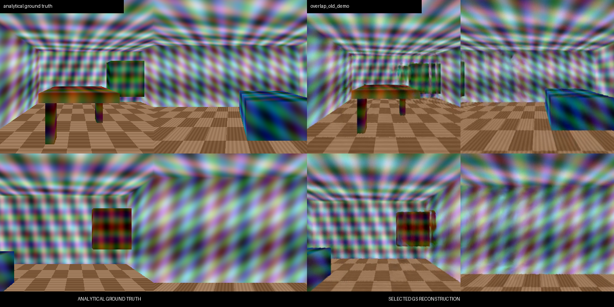

# 360° 彩色方格复核与伪影控制实验

## 结论

视频中的彩色方格和放射纹不是 Gaussian Splatting 产生的光影伪影，而是分析型房间真值中的程序化表面纹理。`scripts/prepare_data.py::trace` 用多组空间正弦和余弦函数直接生成墙面、家具颜色；从相机中心观察平面时，这些世界坐标纹理自然呈放射状。

这一结论由四个方向的真值渲染和三个 GS 模型的同角度帧共同确认。即便将最大 Gaussian 尺度、各向异性和 SH 振幅大幅压低，彩色图案的位置和结构仍与真值一致。



## 已执行实验

| 方案 | 冻结 PSNR | SSIM | LPIPS | 最大尺度 | 最大各向异性 | 平均绝对 SH |
|---|---:|---:|---:|---:|---:|---:|
| 原选择模型 | **14.7287** | **0.3437** | **0.4514** | 0.37707 | 206620.8 | 0.02345 |
| 严格控制 v2 | 14.2969 | 0.3181 | 0.4614 | **0.03296** | **50.0** | **0.00643** |
| 平衡控制 v3 | 14.3765 | 0.3289 | 0.4552 | 0.06592 | 100.0 | 0.01204 |

严格控制与平衡控制都降低了离群 Gaussian 和 SH 强度，但没有消除彩色图案，且三个冻结指标均变差。因此它们不替换原选择模型。

## 代码处理

训练器现已支持可选的置信度加权对数深度监督、Gaussian 最大尺度与各向异性投影、尺度惩罚、SH 延迟启用和 SH 学习率缩放。默认参数保留原质量路径的行为；只有显式传参才启用这些实验约束。

复现实验参数：

```bash
# 严格控制 v2
python scripts/improve_quality.py --base outputs/overlap_anchor --output outputs/quality/overlap_artifact_v2 --steps 6000 --cap 120000 --pose-opt --test-scene data/quality_final_test/analytic_room --depth-weight 0.05 --max-scale-ratio 0.15 --max-anisotropy 50 --scale-reg-weight 0.001 --sh-start-fraction 0.60 --sh-lr-multiplier 0.50

# 平衡控制 v3
python scripts/improve_quality.py --base outputs/overlap_anchor --output outputs/quality/overlap_artifact_v3 --steps 6000 --cap 120000 --pose-opt --test-scene data/quality_final_test/analytic_room --depth-weight 0.01 --max-scale-ratio 0.30 --max-anisotropy 100 --scale-reg-weight 0.001 --sh-start-fraction 0.30 --sh-lr-multiplier 0.75
```

视觉证据位于数据盘 `D:/VGGT-XR-artifacts/quality_20260915/artifact_control/`，服务器实验保存在 `/root/autodl-tmp/vggt-xr/outputs/quality/`。
