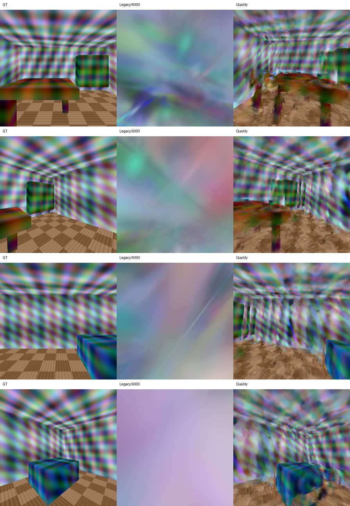
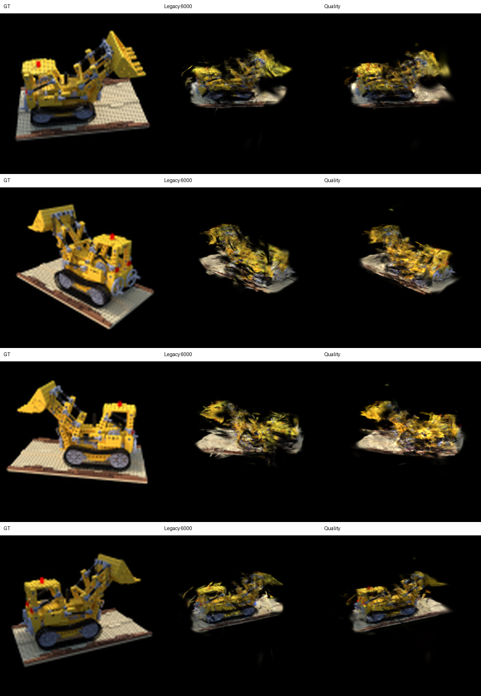
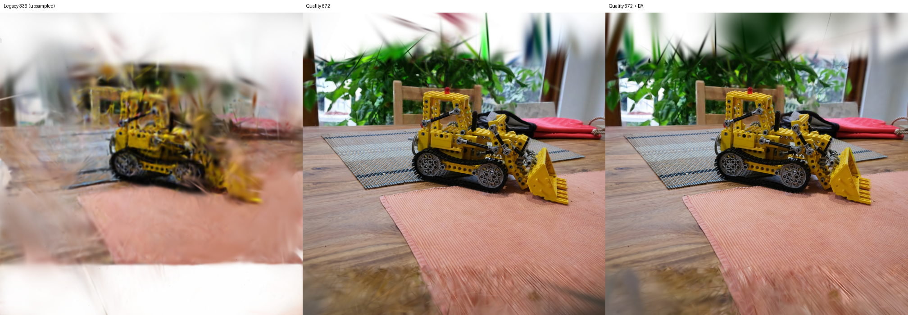

# 重建质量改进实测报告

日期：2026-09-15。服务器：RTX 5090 32 GB，PyTorch 2.12.1+cu130，gsplat 1.5.3，pycolmap 4.2.0。研究依据见 [Deep Research](../docs/QUALITY_DEEP_RESEARCH.zh-CN.md)，选择规则在取得全景消融结果和查看 final test 前写入 [冻结策略](../docs/QUALITY_SELECTION_POLICY.zh-CN.md)。

## 实现变化

- 将真实图的 VGGT 几何推理从 336 提至 518，Gaussian 颜色监督从 336 提至 672；按有效图像 rectangle 计算 K 的仿射变换，padding 不参与光度损失和点初始化。
- 将 sigmoid RGB / SH0 改为真正 SH3 并逐阶激活；采用局部 3-NN RMS 初始尺度、opacity 0.1、means LR 指数衰减。
- 加入硬 cap 的 AbsGrad 密度控制，点数与 Adam/strategy 状态同步。修复项目 wrapper 中 gsplat 1.5.3 opacity reset 条件错误，系统包未修改。
- 相机优化冻结 gauge，限制为小 SE(3) 修正；全景每个 ERP 只优化一个共享刚体，10 个虚拟视角仍保持共同中心和相对旋转。
- 真实图片另做 SIFT tracks、三角化和 robust BA；只有通过 tracks 覆盖、最大旋转和平移保护条件才进入对照。
- 支持 SH3 PLY 和旧 SH0 checkpoint 的统一渲染；增加结果 hash、finite、cap、rig 和三 seed 验证。

## Development 消融

两种数据都在相同 6000 steps 下比较。`legacy6000` 使用旧训练器；后三行同时恢复 SH/初始化/LR，所以不是 SH 单因素实验。

| 数据 / 配置 | Gaussian | PSNR ↑ | SSIM ↑ | LPIPS ↓ | 训练 PSNR ↑ |
|---|---:|---:|---:|---:|---:|
| TinyNeRF legacy6000 | 30,000 | 12.125 | 0.643 | 0.326 | 未记录 |
| TinyNeRF SH3 fixed | 30,000 | **12.410** | **0.647** | 0.323 | 20.432 |
| TinyNeRF SH3 dense | 43,010 | 12.270 | 0.646 | 0.318 | 22.191 |
| TinyNeRF SH3 dense + pose | 43,731 | 12.298 | 0.644 | **0.318** | 22.734 |
| 360° legacy6000 | 30,000 | 14.449 | 0.344 | 0.453 | 未记录 |
| 360° SH3 fixed | 30,000 | 14.468 | **0.349** | 0.464 | 30.510 |
| 360° SH3 dense | 119,915 | 14.610 | 0.349 | 0.461 | 35.456 |
| 360° SH3 dense + rig pose | 119,923 | **14.729** | 0.344 | **0.451** | 35.498 |

更多点显著提高 training score，但 TinyNeRF 的 heldout PSNR 反而低于 fixed；这是增密过拟合的直接反例。冻结规则因此为 TinyNeRF 选择 SH3 fixed，为全景选择 SH3 dense + rig pose。

## 冻结新位置测试

在配置选择前冻结了 8 张未使用 TinyNeRF 图像和三个新合成全景位置的 30 个 viewport。旧训练器为单 seed 参考；新配置报告 seed 42、43、44 的均值 ± 样本标准差。

| 数据 | 配置 | PSNR ↑ | SSIM ↑ | LPIPS ↓ |
|---|---|---:|---:|---:|
| TinyNeRF | legacy6000, seed 42 | 13.123 | 0.656 | 0.316 |
| TinyNeRF | SH3 fixed, 3 seeds | **13.284 ± 0.017** | **0.657 ± 0.001** | **0.314 ± 0.001** |
| 360° 三个新位置 | legacy6000, seed 42 | 8.617 | 0.186 | 0.793 |
| 360° 三个新位置 | SH3 dense + rig pose, 3 seeds | **14.343 ± 0.019** | **0.333 ± 0.005** | **0.461 ± 0.002** |

全景冻结测试提升为 +5.726 dB PSNR、+0.147 SSIM、-0.332 LPIPS。它是同一分析场景的新位置测试，支持方法在该受控场景中更稳定；它不支持真实全景泛化或 SOTA 声明。TinyNeRF 提升小但方向一致，且三 seed 方差低。

## 真实图片结果

真实 kitchen 没有独立 GT pose，不能产生可信 heldout PSNR。24 张训练图的 SIFT BA 使用 4,900 points / 13,482 observations，将平均重投影误差由 **0.717 px 降至 0.432 px**；每图至少 89 个点，最大旋转变化 1.299°，最大归一化平移变化 0.0153，因而通过保护条件。

| 配置 | 分辨率 | Gaussian | Training PSNR | Training SSIM | 训练时间 | 峰值显存 |
|---|---:|---:|---:|---:|---:|---:|
| 高清，无 BA | 672² | 199,951 | 29.103 | 0.916 | 125.0 s | 0.595 GiB |
| 高清，SIFT BA | 672² | 199,966 | **31.460** | **0.947** | 124.9 s | 0.595 GiB |

这些是 training reconstruction scores，只说明训练观测拟合和清晰度，不能作为真实新视角指标。固定视图显示主体细节明显恢复；镜头远离输入轨迹时仍可能暴露错误几何。

## 验证与限制

服务器验证覆盖 15 个质量输出：checkpoint 有限值、Gaussian 硬 cap、SH 非零、相机有限值、全景组共同中心、final test 文件 hash 及三个完整 seed。原测试由 6 项增至 8 项并通过。系统盘保持 783 MB；全部新 cache、数据、checkpoint、日志和视频位于 `/root/autodl-tmp/vggt-xr`，数据盘仍约 158 GiB 可用。

首次 BA 任务在读取 pycolmap 4.2.0 的 property 时误作函数调用而退出；SIFT、三角化和 BA 已实际执行但结果未被接受。修正 API 后使用独立 `kitchen518_ba2` 目录完整重跑并通过保护条件，失败输出保留。服务器当前 pycolmap 4.2.0 没有最新 panorama API，因此没有把 COLMAP main 的 rig 脚本拼进环境。

改善后的真实视频位于本机 `D:\VGGT-XR-artifacts\quality_20260915`，属于 gsplat CUDA 渲染。Unity 尚未编译运行，这些视频不是 Unity 录像。
